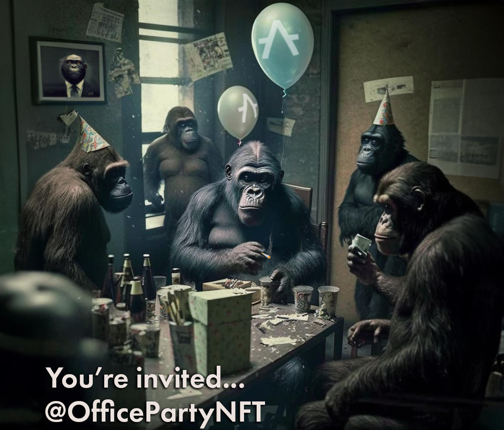

# NFT Verification for Aleph Zero, built with the ink!athon – DApp Boilerplate for Substrate & ink!

---

A humble NFT verification website that uses a discord bot and a backend server to verify a user through an NFT.

By Bug Bite

Join our [Discord](https://discord.gg/HkvPV3gAcy) 💬

---

## Disclaimer 🚨

This repository is still work-in-progress and there are probably bugs. I will be updating it over the coming weeks/months.

